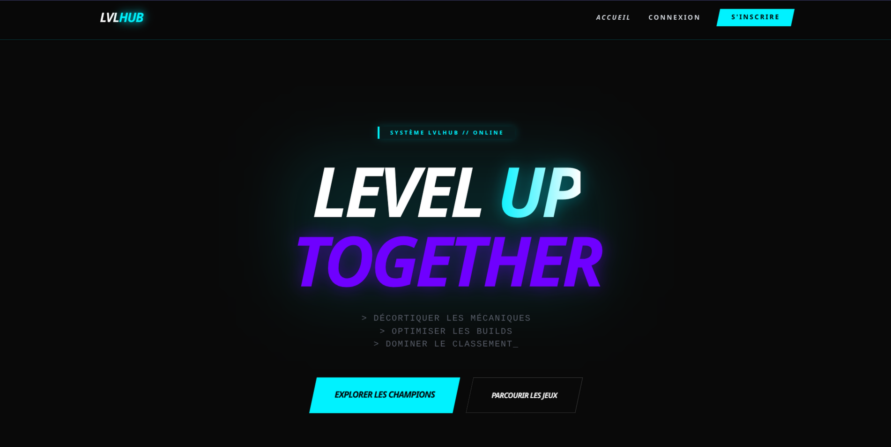

# LvlHub – League of Legends Optimization Platform


## Overview

LvlHub is a web platform designed to help League of Legends players optimize their builds, improve decision-making, and manage their playtime efficiently through real-time updated tools.

The project focuses on delivering a clean, responsive, and user-friendly interface while integrating dynamic data from an external API.

## Learning Objectives

### Build Static Web Interfaces

- Develop structured web pages using HTML5 semantic elements
- Create responsive layouts with CSS3 (Flexbox & Grid)
- Ensure accessibility and mobile compatibility

### Develop Dynamic User Interfaces

- Use JavaScript (ES6) to handle interactivity
- Fetch and display external data using Fetch API
- Organize code with JavaScript modules

## Features

- Responsive Grid Layout
  - 4 columns on desktop
  - 1 column on mobile

- Search & Filtering
  - Search champions by name
  - Filter by roles

- Champion Modal
  - Name and title
  - Description
  - Abilities overview

- Sorting System
  - Sort by preparation time (adaptable for builds/game data)


- Modern UI
  - Clean design
  - Neon 

## Technologies

- HTML5 – Semantic structure
- CSS3 – Flexbox, Grid, Media Queries
- JavaScript (ES6) – Modules, Fetch API
- API – 

## Installation

```bash
git clone https://github.com/Exal0/LvlHub.git
cd LvlHub

Then open index.html in your browser or run a local server:

```bash
npx serve
```

## Possible Improvements

- Integration with a real League of Legends API (Riot API)
- User accounts and saved builds
- Advanced filtering (items, win rate, meta)
- Performance optimization and caching
- Backend integration (Node.js / Express)

## Preview



## License

This project is for educational purposes.
